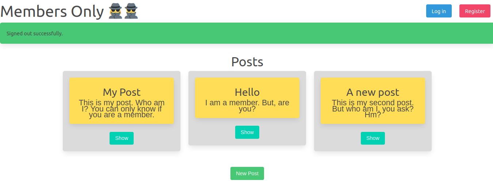
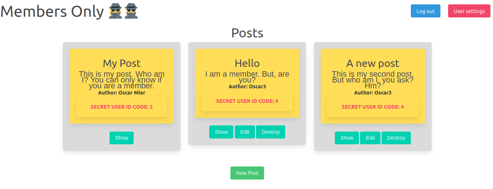

# Ruby on Rails: Blogger tutorial solution

 Solution to the *Members only* excercises from The Odin Project's [Authentication Section](https://www.theodinproject.com/courses/ruby-on-rails/lessons/authentication). We added an extra feature to show User IDs only if the signed-in user selected the "Are you a member?" option during sign-up.

## Screenshots

### Before log-in

### After log-in

### Prerequisites

Follow the installation instructions [for Ruby](https://www.theodinproject.com/courses/ruby-programming/lessons/installing-ruby-ruby-programming) and [Rails](https://www.theodinproject.com/courses/ruby-on-rails/lessons/your-first-rails-application-ruby-on-rails) from The Odin Project.

## Live Demo

To be updated

## Author

**Oscar Mier**
- Github: [@voscarmv](https://github.com/voscarmv)
- Twitter: [@voscarmv](https://twitter.com/voscarmv)
- Linkedin: [Oscar Mier](https://www.linkedin.com/in/oscar-mier-072984196/) 

**Alexis Sanchez**
- Github: [@Psiale](https://github.com/Psiale)
- Twitter: [@TFH_](https://twitter.com/TFH_)
- Linkedin: [Alexis Sanchez](https://www.linkedin.com/in/alexis-gabriel-sánchez-cárcamo-264ba7194/)

## 🤝 Contributing

Contributions, issues and feature requests are welcome!

Feel free to check the [issues page](https://github.com/Psiale/members_only/issues).

## Show your support

Give a ⭐️ if you like this project!

## Acknowledgments

- Thanks to [Microverse](www.microverse.org) for the opportunity.
- Thanks to [The Odin Project](https://www.theodinproject.com/) for the guidance.

## 📝 License

This project is MIT licensed.
